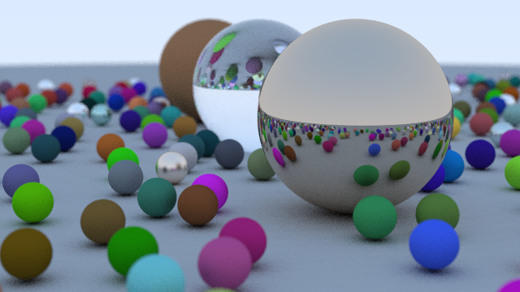

# rtow-rs



## What's this?

rtow-rs is a weekend ray tracer in Rust, which is following [@Peter_shirley](https://twitter.com/Peter_shirley)'s textbook.

## Usage

To get an image run:

```sh
cargo run --release
```

If you give sunrise, you will get another result 🌅.

```sh
cargo run --release sunrise
```

## LICENSE

This software is released under the MIT License, see LICENSE.txt.
